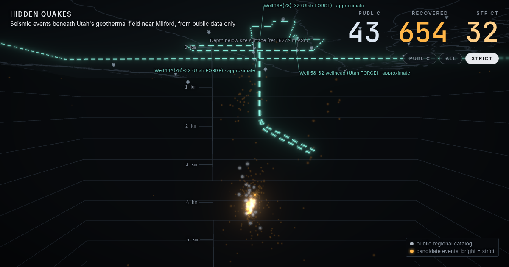

# Hidden Quakes

Small earthquakes hiding in public seismic data, found and shown in 3D.



**Live demo:** https://hidden-quakes-final.vercel.app

## What it is

Geothermal energy is growing near Milford, Utah, and the teams working there watch tiny earthquakes with sensors deep underground. Everyone else only gets the public earthquake catalog, which on September 10, 2026 listed 43 events in the area.

We took one day of free, public seismometer data from the same area and ran it through our own pipeline. It found 654 candidate events, including all 43 of the known ones. 32 of them pass our strictest quality bar, and 14 of those aren't in the public catalog at all.

The website lets you see all of it. Press Space and the ground turns see-through as the candidate events light up underground. Click any event to see the actual seismograms behind it.

## How it works

1. **Get the data.** About 24 public stations (surface and borehole sensors) from EarthScope, for one full day.
2. **Mark the waves.** A pretrained neural network (PhaseNet) marks every P and S wave arrival at every station.
3. **Group them.** PyOcto groups marks from different stations that belong to the same event.
4. **Locate each event.** Our own locator searches a 3D grid for the point that best explains the arrival times, using the published velocity model for the site.
5. **Grade and check.** Each event gets a quality tier calibrated against the known events. We also scramble every station's clock to see what pure chance produces, compare against a classic detector, and trained a small model (the Scramble test) that tells real events from scrambled decoys.

We call them candidate events, not confirmed earthquakes, and we never say what caused them.

## Try it

| Key | What it does |
| --- | --- |
| Space | Reveal the events, then show only the strict ones, then replay the day |
| H | Jump to a strict event the public catalog doesn't have |
| E | Open the evidence for the best-recorded event |
| G | Play a guided tour |
| P | Top-down plan view with a depth section |
| ? | How it works and all the keys |

There's also a Listen button (the busiest hour at one borehole station, sped up so you can hear it), an event list, a download of the whole catalog, share links for any event, and a TODAY view that runs the same pipeline on recent data.

## Run it locally

You need Node with pnpm. The data is already in the repo, so the website runs without the pipeline.

```
pnpm install
make offline
```

Then open http://127.0.0.1:4173. It works with Wi-Fi off.

To rerun the pipeline itself you also need Python 3.13 and uv (`cd services/seismic && uv sync`). `make check` runs all the tests.

## What's in the repo

```
apps/web/            the website (Next.js, React Three Fiber)
services/seismic/    the Python pipeline: download, picking, association, location, tiers, validation, export
services/api/        a worker that reruns the pipeline on recent data
packages/contracts/  the data formats shared between the pipeline and the website
scripts/             export, offline serving, terrain baking and other helpers
docs/                architecture, data formats, deployment and demo notes
```

## Data and credits

Everything is public: waveforms and station data from EarthScope, the public regional catalog from USGS ComCat (University of Utah Seismograph Stations), elevations from USGS 3DEP, the FORGE velocity model and well surveys from the DOE Geothermal Data Repository, and FORGE outlines from the Utah Geological Survey. Picking uses PhaseNet through SeisBench, and association uses PyOcto.

## Team

Built at HackGT 13 by Hieu, Neel, Praneel and Sri, with AI coding assistants helping write the code.
